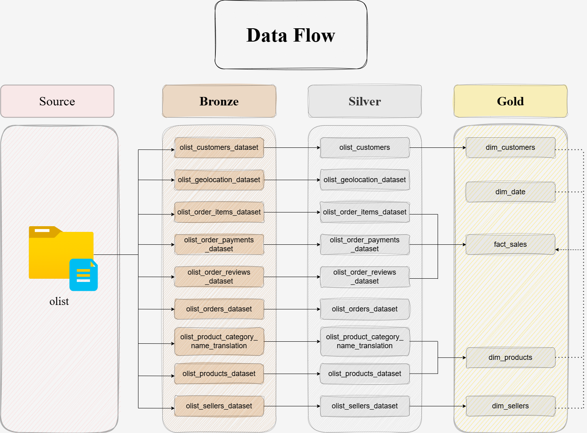
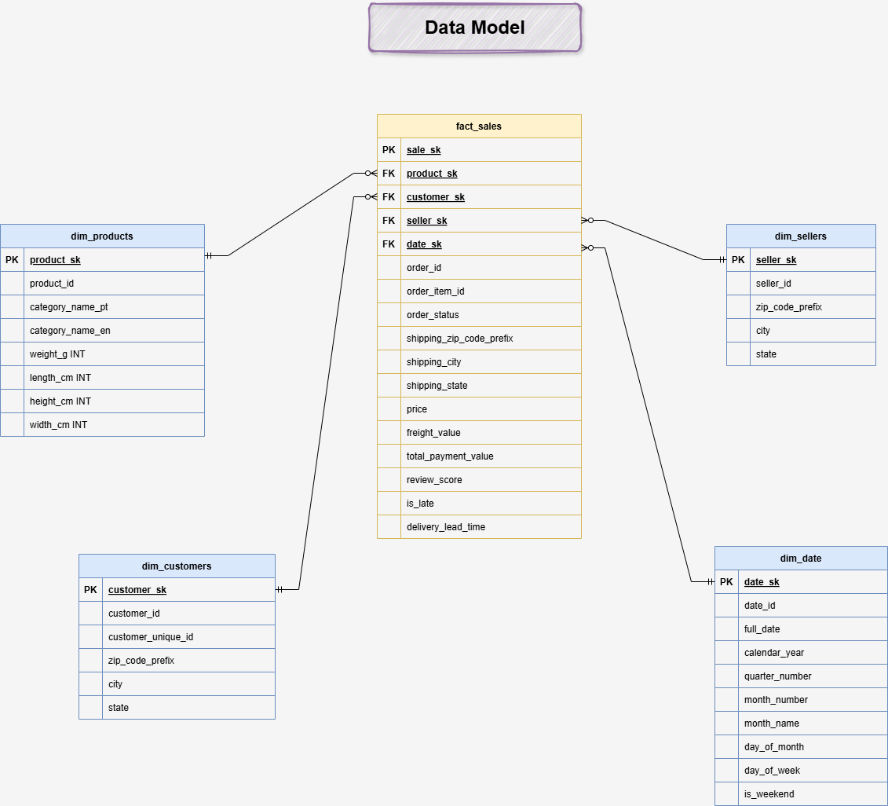
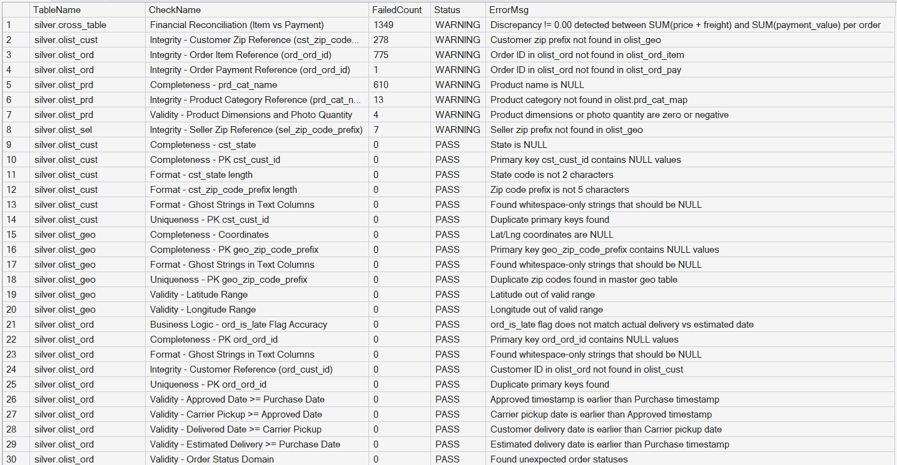
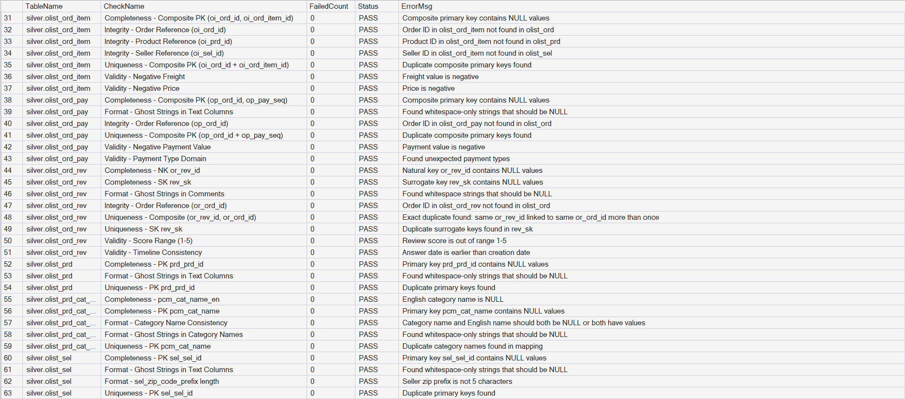
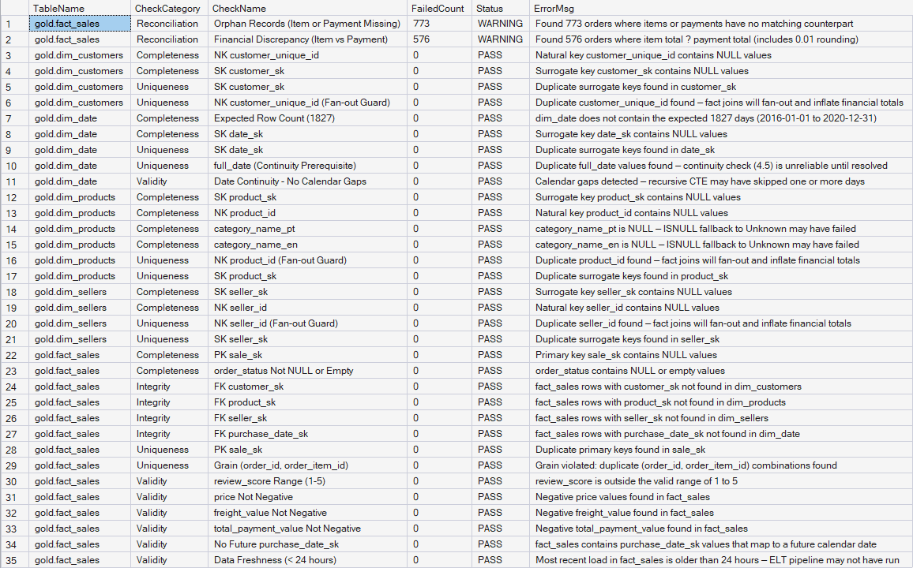

# Olist E-Commerce Data Warehouse

## Overview

This project builds a **complete Data Warehouse** for the [Brazilian Olist e-commerce dataset](https://www.kaggle.com/datasets/olistbr/brazilian-ecommerce) using **Microsoft SQL Server** and the **Medallion Architecture**.

Data flows through three layers:

| Layer | Schema | Purpose |
|-------|--------|---------|
| **Bronze** | `bronze` | Raw ingestion — data lands exactly as it arrives from the source. |
| **Silver** | `silver` | Cleaned, typed, and standardized — the "single version of truth." |
| **Gold** | `gold` | Star Schema optimized for analytics and reporting. |

The pipeline is executed manually through **Python scripts** and **T-SQL Stored Procedures** with centralized logging, transaction safety, and data quality checks.

---

## Data Flow Architecture

Data moves through three layers following the **Medallion Architecture** pattern. Each layer adds a level of refinement, transforming raw source files into analytics-ready tables.

1. **Bronze** — Raw CSV files are bulk-loaded into SQL Server with no transformation. The data is an exact replica of the source.
2. **Silver** — Stored Procedures clean, type-cast, standardize, and deduplicate the data. This layer is the single version of truth.
3. **Gold** — Silver tables are joined and reshaped into a **Star Schema** optimized for analytical queries and reporting.



---

## Data Model

The Gold layer implements a **Star Schema** following the Kimball methodology. A central `fact_sales` table (grain: one row per order item) connects to four dimension tables via surrogate key relationships.

This design enables efficient slicing and dicing across customers, products, sellers, and time — providing fast, intuitive queries without requiring complex multi-table joins at query time.



---

## Naming Conventions

Consistent naming makes the warehouse easier to navigate and maintain. Each layer follows a clear rule:

### Bronze & Silver — Source-Centric

```
<source>_<entity>
```

- **`<source>`** — Name of the source system (e.g., `olist`).
- **`<entity>`** — Original table name, abbreviated for brevity (e.g., `cust`, `ord`, `prd`).

> **Example:** `olist_cust` — Customer data from the Olist system.

Bronze and Silver share the same naming pattern so you can trace a table across layers at a glance.

### The Surrogate Key Exception

Surrogate Keys (SK) **do not** follow the source prefix convention.

| Convention | Example | Why |
|---|---|---|
| Source prefix | `or_rev_id` | This column originates from the Olist source system. |
| No prefix | `rev_sk` | This key is **internal** to our warehouse — it has no meaning in the source. |

SKs are system-generated identifiers created by the Data Warehouse itself. Omitting the source prefix makes it immediately clear that a column is warehouse-internal, not a source field.

### Gold — Business-Centric

```
<type>_<entity>
```

- **`<type>`** — Role in the Star Schema:
  - `fact_` — Quantitative measures and foreign keys (e.g., `fact_sales`).
  - `dim_` — Descriptive attributes / dimensions (e.g., `dim_customers`, `dim_products`).
- **`<entity>`** — The business subject area.

> **Example:** `fact_sales` — Central fact table containing sales metrics and links to all dimensions.

---

## Data Catalog for Gold Layer

The Gold Layer is the business-level data representation, structured using a **Star Schema** to support analytical queries and reporting. It consists of **4 dimension tables** and **1 fact table**.

### 1. **gold.dim_customers** (Identity Resolution)

- **Purpose:** Stores one row per unique person with their current (latest) shipping address.
- **Source:** `silver.olist_cust` JOIN `silver.olist_ord`
- **Grain:** One row per `customer_unique_id` (one real-world person).
- **Logic:** `ROW_NUMBER()` partitioned by `customer_unique_id`, ordered by `purchase_ts DESC` picks the most recent order to determine current location.

| Column Name        | Data Type     | Constraint | Description                                                              |
|--------------------|---------------|------------|--------------------------------------------------------------------------|
| customer_sk        | INT           | PK         | Surrogate key uniquely identifying each customer record.                 |
| customer_unique_id | VARCHAR(50)   | NOT NULL   | Natural key: persistent buyer identifier — one row per real-world person.|
| zip_code_prefix    | CHAR(5)       | NULL       | Latest shipping ZIP code prefix (from most recent order).                |
| city               | NVARCHAR(100) | NULL       | Latest standardized city name (from most recent order).                  |
| state              | CHAR(2)       | NULL       | Latest Brazilian state abbreviation (e.g., SP, RJ, MG).                 |
| dwh_create_date    | DATETIME2     | NOT NULL   | Timestamp when this record was inserted into the gold layer.             |

---

### 2. **gold.dim_products**

- **Purpose:** Provides product attributes including category, listing details, and physical dimensions.
- **Source:** `silver.olist_prd` LEFT JOIN `silver.olist_prd_cat_map`
- **Grain:** One row per product.

| Column Name        | Data Type     | Constraint | Description                                                              |
|--------------------|---------------|------------|--------------------------------------------------------------------------|
| product_sk         | INT           | PK         | Surrogate key uniquely identifying each product record.                  |
| product_id         | VARCHAR(50)   | NOT NULL   | Natural key: original product identifier from the source system.         |
| category_name_pt   | NVARCHAR(100) | NULL       | Product category in Portuguese as it appears in the raw data.            |
| category_name_en   | NVARCHAR(100) | NULL       | Product category translated to English; NULL if no mapping exists.       |
| name_length        | INT           | NULL       | Character count of the product name on the listing.                      |
| description_length | INT           | NULL       | Character count of the product description.                              |
| photos_quantity    | INT           | NULL       | Number of photos published for this product.                             |
| weight_g           | INT           | NULL       | Product weight in grams.                                                 |
| length_cm          | INT           | NULL       | Product length in centimetres.                                           |
| height_cm          | INT           | NULL       | Product height in centimetres.                                           |
| width_cm           | INT           | NULL       | Product width in centimetres.                                            |
| dwh_create_date    | DATETIME2     | NOT NULL   | Timestamp when this record was inserted into the gold layer.             |

---

### 3. **gold.dim_sellers**

- **Purpose:** Stores seller details with standardized geographic information.
- **Source:** `silver.olist_sel`
- **Grain:** One row per seller.

| Column Name      | Data Type     | Constraint | Description                                                              |
|------------------|---------------|------------|--------------------------------------------------------------------------|
| seller_sk        | INT           | PK         | Surrogate key uniquely identifying each seller record.                   |
| seller_id        | VARCHAR(50)   | NOT NULL   | Natural key: original seller identifier from the source system.          |
| zip_code_prefix  | CHAR(5)       | NULL       | First 5 digits of the seller's postal / ZIP code.                        |
| city             | NVARCHAR(100) | NULL       | Standardized seller city name (sourced from `sel_city_std`).             |
| state            | CHAR(2)       | NULL       | Brazilian state abbreviation (e.g., SP, MG, PR).                        |
| dwh_create_date  | DATETIME2     | NOT NULL   | Timestamp when this record was inserted into the gold layer.             |

---

### 4. **gold.dim_date**

- **Purpose:** Static calendar dimension enabling time-based analysis.
- **Source:** Generated via recursive CTE (no silver source table).
- **Grain:** One row per calendar day.
- **Range:** 2016-01-01 to 2020-12-31

| Column Name      | Data Type    | Constraint | Description                                                              |
|------------------|--------------|------------|--------------------------------------------------------------------------|
| date_sk          | INT          | PK         | Surrogate key, sequential by date due to ordered INSERT.                 |
| date_id          | INT          | UNIQUE     | Natural key in YYYYMMDD format for fast filtering (e.g., 20180315).      |
| full_date        | DATE         | UNIQUE     | The actual calendar date value for direct date arithmetic.               |
| calendar_year    | INT          | NOT NULL   | Four-digit calendar year (e.g., 2018).                                   |
| quarter_number   | INT          | NOT NULL   | Calendar quarter number (1-4).                                           |
| quarter_name     | NVARCHAR(2)  | NOT NULL   | Quarter label for reports (e.g., Q1, Q4).                                |
| month_number     | INT          | NOT NULL   | Month number (1 = January, 12 = December).                               |
| month_name       | NVARCHAR(20) | NOT NULL   | Full English month name (e.g., January, November).                       |
| month_name_short | NVARCHAR(3)  | NOT NULL   | Three-letter abbreviation (e.g., Jan, Nov).                              |
| day_of_month     | INT          | NOT NULL   | Day of the month (1-31).                                                 |
| day_of_week      | INT          | NOT NULL   | ISO weekday number: 1 = Monday, 7 = Sunday (locale-safe).               |
| day_name         | NVARCHAR(20) | NOT NULL   | Full English weekday name (e.g., Monday, Friday).                        |
| day_name_short   | NVARCHAR(3)  | NOT NULL   | Three-letter abbreviation (e.g., Mon, Fri).                              |
| is_weekend       | BIT          | NOT NULL   | Convenience flag: 1 = Saturday or Sunday, 0 = weekday.                   |
| dwh_create_date  | DATETIME2    | NOT NULL   | Timestamp when this record was inserted into the gold layer.             |

---

### 5. **gold.fact_sales**

- **Purpose:** Central fact table storing transactional sales data at the order-item grain.
- **Source:** `silver.olist_ord_item` (grain driver), joined with `silver.olist_ord`, `silver.olist_ord_pay`, and `silver.olist_ord_rev`.
- **Grain:** One row per order item (`order_id` + `order_item_id`), enforced by a UNIQUE constraint.

| Column Name         | Data Type     | Constraint | Description                                                              |
|---------------------|---------------|------------|--------------------------------------------------------------------------|
| sale_sk             | INT           | PK         | Surrogate key uniquely identifying each fact row.                        |
| order_id            | VARCHAR(50)   | NOT NULL   | Degenerate dimension: original order hash from the source system.        |
| order_item_id       | INT           | NOT NULL   | Degenerate dimension: sequential item number within the order (1-based). |
| order_status        | NVARCHAR(20)  | NULL       | Order lifecycle status (e.g., delivered, shipped, canceled).             |
| customer_sk         | INT           | FK         | Foreign key to `dim_customers`; identifies the purchasing customer.      |
| product_sk          | INT           | FK         | Foreign key to `dim_products`; identifies the purchased product.         |
| seller_sk           | INT           | FK         | Foreign key to `dim_sellers`; identifies the fulfilling seller.          |
| purchase_date_sk    | INT           | FK         | Foreign key to `dim_date`; date the order was placed.                    |
| price               | DECIMAL(18,2) | NULL       | Selling price of this specific order item.                               |
| freight_value       | DECIMAL(18,2) | NULL       | Freight / shipping cost attributed to this item.                         |
| total_payment_value | DECIMAL(18,2) | NULL       | Total amount paid for the entire order across all payment methods. **Note:** order-level metric at item grain — use `MAX()` when aggregating across items. |
| review_score        | INT           | NULL       | Customer satisfaction rating (1-5). Deduplicated to one review per order. |
| is_late             | BIT           | NULL       | Delivery flag: 1 = late, 0 = on time or early.                          |
| delivery_lead_time  | INT           | NULL       | NULL if not yet delivered or if delivery date precedes purchase date |
| dwh_create_date     | DATETIME2     | NOT NULL   | Timestamp when this record was inserted into the gold layer.             |

---

## Data Schema

The following diagram provides a high-level view of the table structures across all layers. Column names, data types, and key constraints are defined to ensure data consistency and optimal query performance throughout the warehouse.


---

## Data Quality Audit Evidence

Data Quality audits are performed on both the Silver and Gold layers to ensure data integrity and business logic compliance.

### Data Quality Check Categories

| Check Category | Definition | Project Application (Examples) |
|---|---|---|
| **Uniqueness** | Ensures no duplicate records exist within a table, preserving the defined grain and preventing inflated aggregations. | Primary Key uniqueness on `sale_sk`; composite grain check on `order_id` + `order_item_id` in `fact_sales`. |
| **Completeness** | Verifies that mandatory fields are populated and critical business columns contain no NULL values. | `customer_unique_id` is never NULL in `dim_customers`; `price` and `freight_value` are present in `fact_sales`. |
| **Integrity** | Validates referential integrity and relationships between tables across the Medallion layers (Bronze, Silver, Gold). | Every `customer_sk` in `fact_sales` has a matching record in `dim_customers`; no orphaned Foreign Keys across dimension lookups. |
| **Validity** | Ensures data follows specific formats, business rules, and expected value ranges. | `price >= 0`; `review_score` between 1 and 5; purchase dates are not in the future; delivery dates are never before order dates. |
| **Reconciliation** | High-level audit to ensure data balance between layers and cross-table financial consistency. | Row count comparison between `silver.olist_ord_item` and `gold.fact_sales`; financial totals split into two checks: **(1) Orphan Records** — orders present on only one side (items or payments); **(2) Financial Discrepancy** — orders where both sides exist but `SUM(Price + Freight) ≠ SUM(Payments)` (includes ±0.01 rounding). Both are `WARNING`. |

### Unified Reporting Schema

Both audit scripts produce a unified result set. The Gold layer includes an additional `CheckCategory` column for grouping.

| Column | Layer | Description |
|---|---|---|
| `TableName` | Both | The table being audited. |
| `CheckCategory` | Gold only | DQ category: Completeness, Uniqueness, Integrity, Validity, or Reconciliation. |
| `CheckName` | Both | Descriptive name of the validation rule. |
| `FailedCount` | Both | Number of records that triggered a flag. |
| `Status` | Both | Verdict: `PASS`, `WARNING`, or `FAIL`. |
| `ErrorMsg` | Both | Context about the detected issue. |

### Silver Layer DQ Audit Results




### Gold Layer DQ Audit Results

The reconciliation section contains two checks:
- **Orphan Records** — orders present in items or payments but not both (structural gap, excluded from `fact_sales` by design).
- **Financial Discrepancy** — orders where both sides exist but amounts differ; includes ±0.01 rounding cases and larger mismatches. Both checks are `WARNING`.



---

## Project Structure

```
data-warehouse-project/
├── datasets/                  # Source CSV files (Olist dataset)
├── docs/
│   ├── data_flow.png          # Medallion Architecture diagram
│   ├── data_model.png         # Gold layer Star Schema ERD
│   ├── data_schema.png        # Table structure overview
│   └── screenshots/           # SSMS audit result screenshots
├── scripts/
│   ├── init_database.sql      # Database, schemas, and logging table
│   ├── bronze/
│   │   ├── ddl_bronze.sql        # Bronze table definitions
│   │   └── main_ingestion.py     # Python script for CSV to Bronze ingestion
│   ├── silver/
│   │   ├── ddl_silver.sql     # Silver table definitions
│   │   └── proc_load_silver.sql
│   └── gold/
│       ├── ddl_gold.sql       # Star Schema table definitions
│       ├── ddl_gold_views.sql # Presentation views for reporting
│       └── proc_load_gold.sql
└── tests/
    ├── quality_checks_silver.sql
    └── quality_checks_gold.sql
```

---

## How to Run

1. Execute **`init_database.sql`** to create the database, schemas, and logging table.
2. Run **`main_ingestion.py`** to load raw CSVs into the `bronze` schema.
3. Run **`EXEC silver.load_silver`** to clean and load the Silver layer.
4. Run **`EXEC gold.load_gold`** to build the Star Schema in the Gold layer.
5. Run the quality check scripts in `/tests` to validate data integrity.

---

## Tech Stack

- **Database:** Microsoft SQL Server
- **Ingestion:** Python (Pandas) — batch processing from CSV to Bronze
- **ELT:** T-SQL Stored Procedures
- **Architecture:** Medallion (Bronze → Silver → Gold)
- **Data Model:** Star Schema (Kimball methodology)
